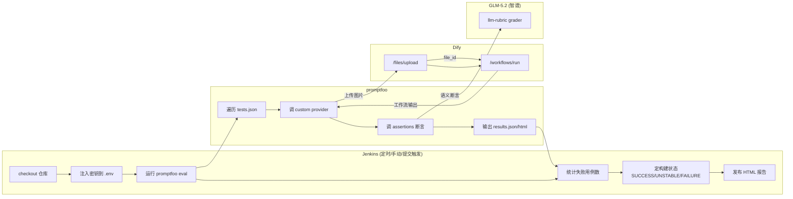

# my_ai_test

AI 应用评测仓库:用 **promptfoo + Jenkins** 自动化测试 Dify 工作流。

当前包含的 use case:
- `dify-eval` —— Dify 动物图片识别工作流评测(5 张图片,5 个断言)

后续可按统一模板接入其他 Dify 工作流,无需改核心代码。

---

## 一、项目简介

本仓库解决一个问题:**如何对 Dify 工作流做可持续的自动化评测**。

直接用 promptfoo 调 Dify 有三个卡点:
1. Dify 工作流的图片/文件输入需要先上传拿 `file_id`,且 `file_id` 会失效,CI 无人值守无法手工重传
2. 不同工作流输入/输出结构不同,硬编码每次都要改代码
3. promptfoo 跑完只是出报告,怎么和 CI 门禁结合(失败用例如何影响构建状态)

本仓库的解法:
- 写一个**配置驱动的 custom provider**(`dify_workflow.js`),每次跑用例实时上传文件,输入/输出结构通过 yaml 配置
- 用 **Jenkins Pipeline** 串起来,自动注入密钥、跑评测、发 HTML 报告、按失败用例数定构建状态

---

## 二、仓库结构

```
my_ai_test/
├── .gitignore                              # 全局忽略规则(递归生效)
├── README.md                               # 本文件
└── promptfoo/
    └── use_cases/
        └── dify-eval/                      # Dify 动物图片识别评测
            ├── .env.example                # 环境变量模板(真实 .env 不入库)
            ├── Jenkinsfile                 # Jenkins 流水线定义
            ├── assertions.js               # 断言函数集(格式/数值/字数/语义)
            ├── check-fails.js              # 失败用例统计(配合 Jenkins 门禁)
            ├── prompt.txt                  # promptfoo prompt 模板
            ├── promptfooconfig.yaml        # 评测配置(provider/inputs/断言)
            ├── promptfooconfig.yaml.example# 5 种输入场景配置示例
            ├── tests.json                  # 测试用例(图片+期望值)
            ├── inputs/                     # 测试图片
            │   ├── input-001.jpg ~ 005.jpg
            └── providers/
                └── dify_workflow.js        # Dify custom provider(配置驱动)
```

---

## 三、架构与工作流

### 调用链



### 一次评测的执行流程

1. **Jenkins 触发** —— 手动 / 定时(每晚 23:00)/ Git 提交
2. **checkout 仓库** —— 从 GitHub 拉最新代码
3. **注入密钥** —— `withCredentials` 把 Jenkins 凭证写成 `.env` 文件(不入库,跑完删)
4. **promptfoo eval** —— 遍历 `tests.json` 每个用例:
   - custom provider 上传图片到 Dify `/files/upload`,拿 `file_id`
   - 用 `file_id` 调 Dify `/workflows/run`,拿工作流输出
   - 按 `outputPath` 提取输出字段,交给断言
5. **断言判定** —— 5 个断言逐个跑(3 个 javascript + 2 个 llm-rubric)
6. **门禁 + 报告** —— `check-fails.js` 统计失败用例数,定构建状态;HTML 报告归档到 Jenkins

---

## 四、核心组件说明

### 1. `providers/dify_workflow.js` —— Dify Custom Provider

**配置驱动**:输入/输出结构通过 `promptfooconfig.yaml` 配置,不改 JS 代码。

支持三种输入类型:

| type | Dify 类型 | provider 行为 |
|---|---|---|
| `file_array` | `Array[File]` | 上传多个文件,传 `[{...}]` 数组 |
| `file` | `File` | 上传单个文件,传 `{...}` 单值 |
| `text` | `String`/`Number` | 不上传,直接塞字符串 |

关键能力:
- 每次跑用例**实时上传文件**,解决 `file_id` 失效问题
- `outputPath` 支持点分路径(如 `data.outputs.output`),从 Dify 响应提取输出
- 内置 429 限流重试(按 `Retry-After` 退避,最多 3 次)

### 2. `assertions.js` —— 断言函数集

5 个断言函数,前 3 个是 javascript(确定性),后 2 个配合 llm-rubric(语义判定):

| 函数 | 类型 | 作用 |
|---|---|---|
| `assertFormat` | javascript | 输出必须是 JSON,含 `name`(string)/`number`(number)/`description`(string) |
| `assertNumber` | javascript | `number` 精确匹配期望值 |
| `assertDescriptionLength` | javascript | `description` 字数 80~120 |
| `transformName` | transform | 提取 `name` 字段供 llm-rubric 判定 |
| `transformDescription` | transform | 提取 `description` 字段供 llm-rubric 判定 |

`parseOutput` 会自动去掉 ` ```json ``` ` 包裹,解析 LLM 输出的 JSON。

### 3. `promptfooconfig.yaml` —— 评测配置

定义四件事:
- **provider**:用哪个 custom provider,输入/输出怎么配
- **tests**:用例文件
- **grader**:断言模型(GLM-5.2,关闭 thinking)
- **assert**:跑哪些断言

### 4. `Jenkinsfile` —— CI 流水线

4 个 stage + post-action:
- `环境诊断` —— 打印 whoami/node/PATH,便于排查环境问题
- `定位 promptfoo` —— 找到 `entrypoint.js`,不依赖 PATH 里有 `promptfoo` 命令
- `运行 promptfoo 评测` —— 注入密钥 + 跑 eval(`-j 1` 串行避免 429)
- post —— 清理 .env、归档产物、发 HTML 报告、统计失败用例定构建状态

### 5. `check-fails.js` —— 失败用例统计

解析 `promptfoo_results.json`,累加 `results.prompts[].metrics.testFailCount`,输出失败数。

**为什么不用 findstr**:见[第八节](#八关键设计决策与踩坑记录)。

---

## 五、快速开始(本地跑通)

### 前置条件

- Node.js ≥ 18
- promptfoo:`npm install -g promptfoo`
- 能访问 Dify 实例和智谱 GLM API

### 步骤

```bash
# 1. clone
git clone https://github.com/wangjinxing01/my_ai_test.git
cd my_ai_test/promptfoo/use_cases/dify-eval

# 2. 配 .env(填真实密钥)
cp .env.example .env
# 编辑 .env,填入 DIFY_API_KEY 和 OPENAI_API_KEY

# 3. (可选)改 promptfooconfig.yaml 适配你的 Dify 工作流
#    主要改 inputs[].varName 和 outputPath

# 4. 跑评测
promptfoo eval -j 1 --env-file .env --no-cache

# 5. 看结果
promptfoo view   # 浏览器打开结果
```

预期输出:
```
Results:
  ✓ 3 passed (60.00%)
  ✗ 2 failed (40.00%)
  0 errors (0%)
```

> 失败数会波动,这是 GLM-5.2 图片识别本身的不确定性,跟流水线无关。**0 errors** 是关键指标。

---

## 六、接入新的 Dify 工作流

### 改哪几个文件

| 文件 | 改不改 | 改什么 |
|---|---|---|
| `dify_workflow.js` | **不用改** | 配置驱动,通用 |
| `promptfooconfig.yaml` | 改 | `inputs`/`outputPath`/断言 |
| `tests.json` | 改 | 用例数据 |
| `assertions.js` | 改 | 断言逻辑(按业务) |
| `inputs/` | 改 | 测试文件 |
| `Jenkinsfile` | 一般不用改 | 除非目录结构变了 |

### 5 种输入场景

详见 `promptfooconfig.yaml.example`,覆盖:

| 场景 | 输入类型 | 例子 |
|---|---|---|
| 单图片输入 | `file_array`(1 张) | 动物识别、OCR、缺陷检测 |
| 图片数组输入 | `file_array`(多张) | 多图比对、相册分类 |
| 单文件输入 | `file` | 文档问答、PDF 解析 |
| 纯文本输入 | `text` | 翻译、摘要、分类 |
| 文本+文件混合 | `text` + `file` | RAG 问答 |

### 改造量评估

| 场景 | 改动量 |
|---|---|
| 同类工作流(单图输入,输出结构相同) | 只改 `tests.json` |
| 输入结构变了(多文件/文本) | 改 `promptfooconfig.yaml` 的 `inputs` |
| 输出结构变了 | 改 `outputPath` + `assertions.js` 的 `parseOutput` |
| 断言逻辑变了 | 改 `assertions.js` |

**`dify_workflow.js` 在 5 种场景下都不用改。**

---

## 七、Jenkins CI 集成

### 前置条件

- Jenkins(Windows 节点)
- HTML Publisher 插件
- Jenkins 能访问 GitHub(需配代理或直连)
- Jenkins 凭证:存两个 Secret Text
  - `dify-apikey`:Dify 应用 API Key(`app-` 开头)
  - `promptfoo-glm-apikey`:智谱 GLM API Key

### 配置步骤

1. **建 Pipeline Job**
   - Definition: Pipeline script from SCM
   - SCM: Git,Repository URL 填本仓库地址
   - Script Path: `promptfoo/use_cases/dify-eval/Jenkinsfile`

2. **配凭证**
   - Jenkins -> Manage Credentials -> 添加两个 Secret Text,ID 分别为 `dify-apikey` 和 `promptfoo-glm-apikey`

3. **触发**
   - 手动:Build Now
   - 定时:`Jenkinsfile` 里已配 `cron('H 23 * * *')`(每晚 23:00)
   - 提交触发:在 Job 配置里勾选 Poll SCM / GitHub hook

### 构建状态语义

| 状态 | 含义 | 触发条件 |
|---|---|---|
| **SUCCESS**(绿) | 评测跑通,0 个失败用例 | `testFailCount = 0` |
| **UNSTABLE**(黄) | 评测跑通,有失败用例 | `testFailCount > 0` |
| **FAILURE**(红) | 评测本身报错/没跑起来 | stage 异常退出 |

> 注意:promptfoo 在有失败用例时以 exit 100 退出,这是正常行为。`Jenkinsfile` 用 `|| ver` 吞掉退出码,避免误判为 FAILURE。详见[第八节](#八关键设计决策与踩坑记录)。

### 查看报告

Jenkins Job 侧边栏 -> **Promptfoo Report** -> 选择构建号,可看历史所有报告。

---

## 八、关键设计决策与踩坑记录

### 1. 为什么用 custom provider(file_id 失效问题)

**问题**:Dify 上传的文件 `file_id` 会过期,CI 无人值守无法手工重传。

**解法**:写 custom provider,每次跑用例时实时上传图片,立即调用工作流。`file_id` 用完即弃,不存在失效问题。

### 2. 为什么关闭 GLM thinking(Could not extract JSON)

**问题**:GLM-5.2 是推理模型,默认开启 thinking。思考过程会污染 `content` 字段,导致 promptfoo 的 llm-rubric grader 解析 JSON 失败,报 `Could not extract JSON from llm-rubric response`,该断言直接判 fail。

**实测对比**:

| 配置 | reasoning_tokens | content |
|---|---|---|
| 默认(思考开启) | 429 | 偶发被思考污染,JSON 解析失败 |
| `thinking: {type: disabled}` | 0 | 干净 JSON |

**解法**:`promptfooconfig.yaml` 的 grader provider config 加:
```yaml
showThinking: false       # promptfoo 只取最终 content
passthrough:
  thinking:
    type: disabled        # 请求时显式关闭思考
```

**附带收益**:速度提升 3 倍,token 消耗降至 1/3。

### 3. 为什么用 `|| ver` 吞掉 promptfoo exit 100

**问题**:promptfoo 在有失败用例时以 exit 100 退出。Jenkins 的 `bat` 步骤会把非 0 退出码判为 stage 失败,导致 post-action 里的门禁判断执行不到(Jenkins 规则:`currentBuild.result` 只能变差不能变好)。

**解法**:命令后加 `|| ver`。cmd 的 `||` 在前者失败时执行后者,`ver` 永远成功,整体退出码恒为 0。stage 不会失败,post-action 能正常跑门禁。

```groovy
bat 'node ... eval ... || ver'
```

### 4. 为什么用 Node 解析 JSON 而非 findstr

**问题**:最初用 `findstr` 统计失败用例,两个 bug:
1. 模式 `"success":false` 不匹配真实 JSON `"success": false`(冒号后有空格)
2. `find /C /V ""` 在空输入时返回 exit code 1,即使输出 `0` 也会让 build 误判 FAILURE

**解法**:写 `check-fails.js`,用 Node 解析 JSON:
```js
for (const p of data.results.prompts) {
  fails += p.metrics.testFailCount || 0;
}
```

Node 已在 PATH 里,不依赖 readJSON 插件,且始终 exit 0。

---

## 九、配置参考

### 环境变量(.env)

| 变量 | 用途 | 示例 |
|---|---|---|
| `DIFY_BASE_URL` | Dify API 地址 | `http://dify.mycompany.com:5001/v1` |
| `DIFY_API_KEY` | Dify 应用 API Key | `app-xxxxxxxx` |
| `DIFY_USER` | Dify 用户标识(任意字符串) | `abc-123` |
| `OPENAI_API_KEY` | 智谱 GLM API Key(promptfoo 默认读此变量) | `xxxxxxxx.xxxxxxxx` |

### `promptfooconfig.yaml` 字段说明

```yaml
providers:
  - id: file://providers/dify_workflow.js
    config:
      inputs:                    # 输入配置(数组,可多项)
        - varName: input_picture # Dify 工作流变量名
          type: file_array       # file_array | file | text
          source: filename       # 从 tests.json vars 的哪个字段取值
          mimeType: image/jpeg   # 文件 MIME(file/file_array 用)
      outputPath: data.outputs.output  # 从 Dify 响应取哪个字段(点分路径)

defaultTest:
  options:
    provider:                    # grader 模型配置
      id: openai:chat:glm-5.2
      config:
        apiBaseUrl: 'https://open.bigmodel.cn/api/paas/v4'
        max_tokens: 4096
        showThinking: false      # 关闭思考(避免 JSON 解析失败)
        passthrough:
          thinking:
            type: disabled
```

### 输入类型对照表

| type | Dify 类型 | provider 行为 | mimeType 影响 |
|---|---|---|---|
| `file_array` | `Array[File]` | 上传多个文件,传 `[{...}]` 数组 | `image/*` -> Dify `type=image`;其他 -> `type=document` |
| `file` | `File` | 上传单个文件,传 `{...}` 单值 | 同上 |
| `text` | `String`/`Number` | 不上传,直接塞字符串 | 不用配 |

### `outputPath` 路径示例

| Dify 响应结构 | outputPath | 提取结果 |
|---|---|---|
| `{data: {outputs: {output: "..."}}}` | `data.outputs.output` | `"..."` |
| `{data: {outputs: {result: {text: "..."}}}}` | `data.outputs.result.text` | `"..."` |
| 不配或路径不存在 | - | 返回完整 Dify 响应 JSON 字符串 |
